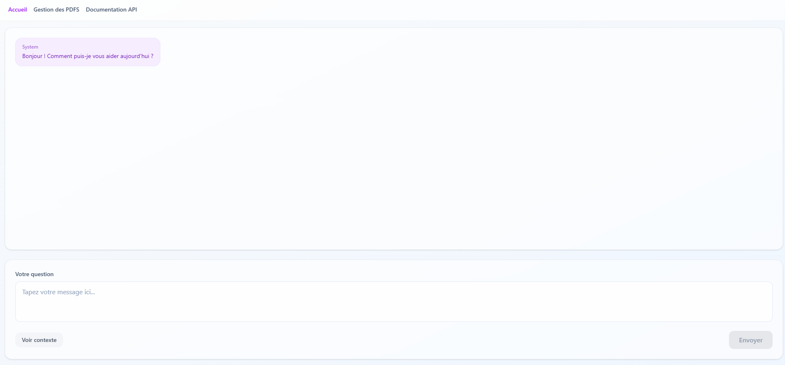
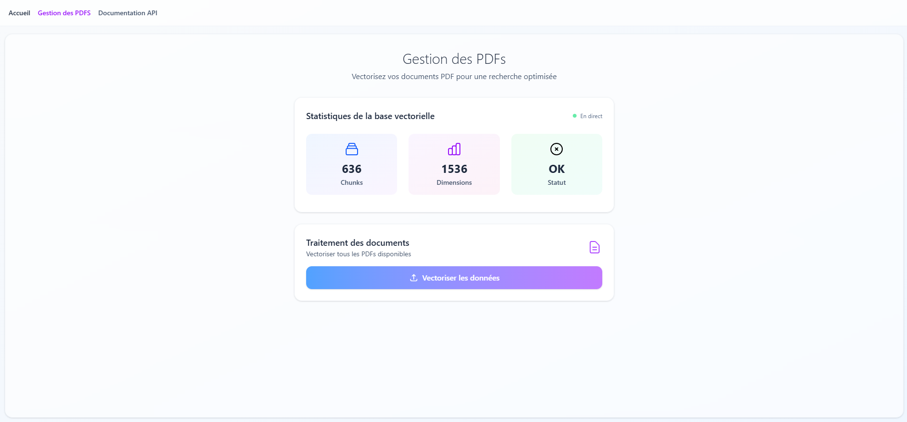

# 🧠 Chat with Data in PDF

## 📌 Description
Ce projet est un chatbot intelligent capable de répondre à des questions en utilisant le contenu de fichiers PDF. Il extrait, segmente et embedd le contenu des documents pour fournir des réponses contextuelles pertinentes.

## 🚀 Fonctionnalités
- 🔍 Chargement et traitement de fichiers PDF
- 🧠 Embedding du contenu pour indexation intelligente
- 💬 Chatbot capable de répondre avec du contexte précis
- 📁 Gestion multi-documents (optionnel selon ta version)
- 🌐 Frontend interactif en Vue.js
- ⚙️ API backend avec FastAPI

## 🛠️ Stack technique

| Composant    | Technologie            | Description                          |
|--------------|------------------------|--------------------------------------|
| Frontend     | Svelte                 | Interface utilisateur moderne        |
| Backend API  | FastAPI                | API REST avec validation automatique |
| Embeddings   | OpenAI / LM STUDIO     | Génération d'embeddings vectoriels   |
| Vector Store | ChromaDB               | Base vectorielle locale              |
| PDF Extract  |                        | Extraction de texte avec structure   |
| AI Chat      | OpenAI GPT / Local LLM | Génération de réponses contextuelles   |
| Langue       | Python + JavaScript TS |Backend robuste + Frontend typé|

## 🧪 DEMO 

## 📝 TODO

### 🔥 Priorité Haute
- Projets multiples (isolation des données)
- Monitoring avancé (métriques, logs structurés, health checks)
- Cache intelligent (mise en cache des embeddings, réponses fréquentes)
- Traitement asynchrone (queue pour traitement de gros PDFs)

### 🚀 Fonctionnalités
 - Import batch (dossier entier, ZIP, Drag & Drop multiple)
 - Export/Import de bases vectorielles (backup, migration)
 - Templates de prompts (personnalisation par domaine)
 - Recherche hybride (vectorielle + mots-clés + métadonnées)
 - Suggestions automatiques (questions suggérées basées sur le contenu)

### 🌐 Frontend & UX
 - Mode sombre/clair (thème utilisateur)
 - Raccourcis clavier (navigation rapide)
 - Markdown/LaTeX dans les réponses (formules, équations)
 - Citations cliquables (lien vers document source)
 - Preview documents (aperçu PDF intégré)
 - Graphiques interactifs (stats, relations entre documents)

### 🔧 Technique

- ests automatisés (unit, integration, e2e)
- CI/CD Pipeline (GitHub Actions, tests auto)
- Docker & Docker Compose (déploiement simplifié)
- Monitoring production (Prometheus, Grafana)
- Rate limiting (protection API)
- Documentation API (exemples, SDK)

### 🎯 Performance

- Streaming responses (réponses en temps réel)
- Pagination intelligente (grands documents)
- Index sophistiqués (recherche multi-niveaux)
- Compression texte (réduction taille stockage)

### 🔐 Sécurité

- Chiffrement données (stockage sécurisé)
- Audit logs (traçabilité des actions)
- Validation robuste (protection injection)
- Sandboxing (isolation traitement PDFs)

## 🤝 Contribution
Les contributions sont les bienvenues ! Voici comment commencer :

1. Fork le repo
2. Crée une branche avec un nom clair : git checkout -b feat/nouvelle-fonction
3. Fais tes modifications
4. Push la branche : git push origin feat/nouvelle-fonction
5. Ouvre une Pull Request

Merci d’inclure une description claire de la fonctionnalité ou du bug corrigé 🙌

📄 Licence
MIT © 2025 - Math-dev-24